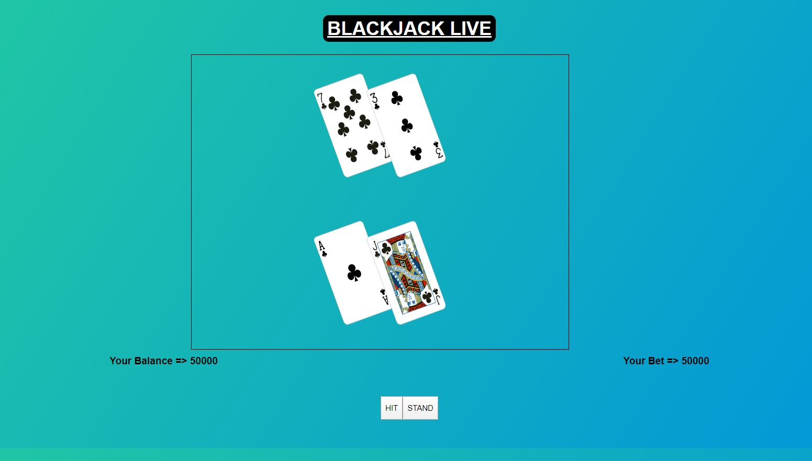

# Simple vanilla javascript based game

Blackjack is one of the most popular card games that are played at casino.
Blackjack is basically a card game where you are dealt two cards, one face down, and one face up to start out with. You decide at that point by counting the amount of the value of the card if you would like another card (hit) to get as close to 21 as you can. Once you decide to stand or stay, the next player has the same option and it goes around the table till the dealers turn comes up. The dealer has the same option as you do at that point. The dealer however, will always stop their
hand once the amount of the cards dealt to them reaches 17 points.

